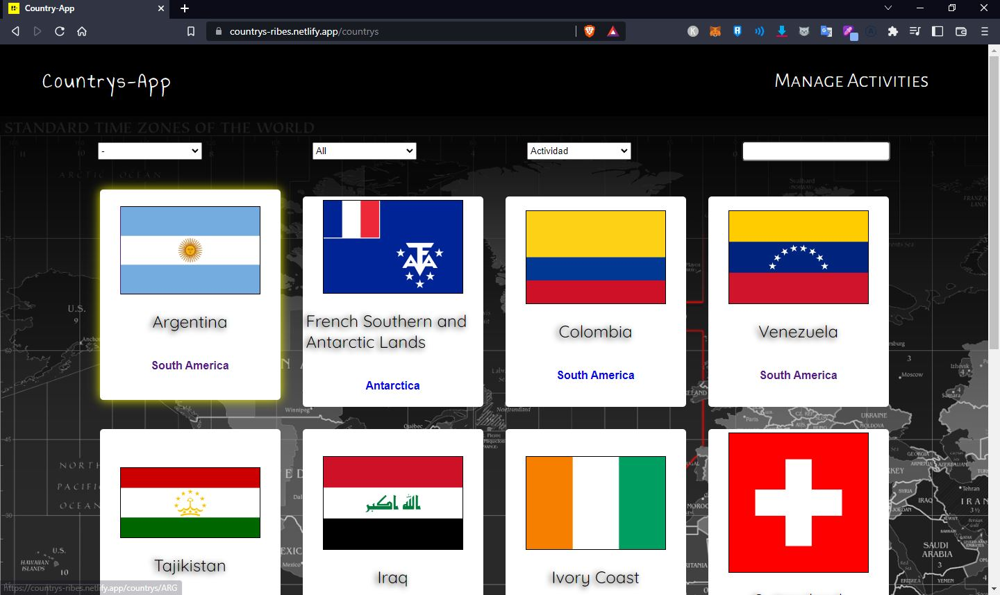

## Table of Contents
1. [General Info](#general-info)
2. [Technologies](#technologies)
3. [Installation](#installation)

### General Info
***

The development of this application has the purpose of adding tourist activities to each country, this project was developed in the SoyHenry bootcamp

El desarrollo de esta aplicacion tiene como finalidad el añadir actividades turisticas a cada pais, este proyecto fue desarrollado en el bootcamp SoyHenry

##Screenshot
***



***

## Technologies
***
A list of technologies used within the project:
* Node: Version 16.13.0 
* React: Version 18.2.0
* Redux: Version 4.0.5
* React-Redux: Version 7.2.9
* Express: Version 4.17.1
* Sequelize: Version 6.3.5

## Installation
***
A little intro about the installation. 
```
$ git clone https://github.com/rodri-ribes/countrys-app.git

./client
    $ npm install
    $ npm start
    
./api
    $ npm install
    $ npm run dev
```
